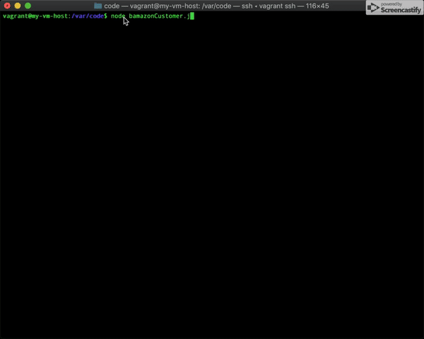

# A Node.js & MySQL command line Amazon-like storefront app that takes in customers orders and depletes stock from the stores Inventory.

# Overview:

## Usage:
* Clone repo
* npm install
* cd Bamazon
* node server.js

# Technologies  Used:
* Node.js
* Express
* MySQL
